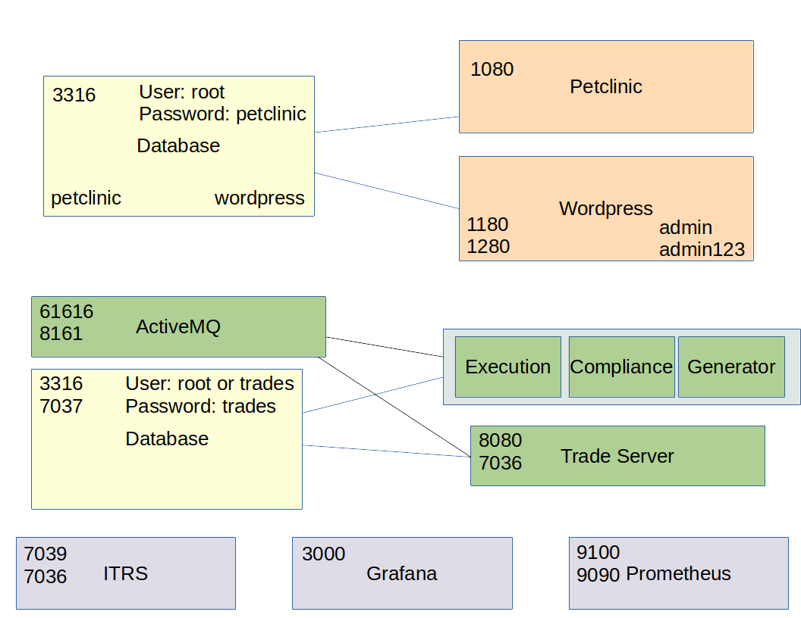

# Monitoring Environment

This project has 2 environments that can be monitored:

* [Petclinic/Moodle](containers/README.md)
* [Trading application](tradeapp/README.md)

Both environments come with Prometheus and Grafana.
ITRS is also available, but you will require your own license for the server.  You will need to use the following detail to register your license:

* hostid = 1fac2b17
* hostname = b4abc4b146ad

If you wish to change these values you'll need to edit the **Dockerfile.ubuntu** in the **itrs** directory.

The license file for ITRS needs to be stored in the ITRSLic directory, so that when you run the **docker-compose** command it will map that directory into the container.  The file must be named **gateway.lic**, and this applies to both projects.

Alternatively comment out the **itrs** service in the **docker-compose.yaml** files.

## Infrastructure diagram of both environments



# Before running

You will need to create your own environment variables file first before running **docker compose**, an example is found in env-setup.

Or you need to make sure all the variables in env-setup exist as environment variables before running **docker compose**.

Variables that must be exported are:
```
export DB_PORT=3316
export DB_PASSWORD=petclinic
export DB_NAME=petclinic
export WORDPRESS_PORT=1180
export WP_HOST=192.168.10.118:${WORDPRESS_PORT}
export DBSERVERNAME=database
export PETCLINIC_PORT=1080
export PROMETHEUS_PORT=9100
export PROMETHEUS_PORT2=9090
export GRAFANA_PORT=3000
```

Once you have the variables in a file you need to **source yourFile**.

Then you can start to use **docker compose** from within the **containers** directory.

The system will perform an automatic Wordpress migration modifying the database data to meet your new servers IP address.  If using AWS or other cloud providers make sure you set **WP_HOST** to the public IP of the instance.  The migration will take approx 1 minute from **docker compose** informing of the DB start up.

The port numbers in the variables are those which will be used to server the services on the host, just in case there are clashes with other programs running on that server.

# Applications

## Wordpress

This service will show the Hello World post by default.

To start using Wordpress you will need to add **/wp-login.php** to the URL.

Credentials are:
* Username: admin
* Password: admin123

### Migration

You will know when the migration has worked by going to **/wp-login.php** and if the URL does not change to **http://localhost:1180/wp-login.php** but remains with your servers IP address or hostname then you are ready to go.

## Petclinic

This is a simple VET system, no credentials, but allows you to add pets and owners to the system.

## Database (MySQL)

This server by default will use the following credentials:
* Username: root
* Password: petclinic

Databases are installed for the above applications and named:
* petclinic
* wordpress